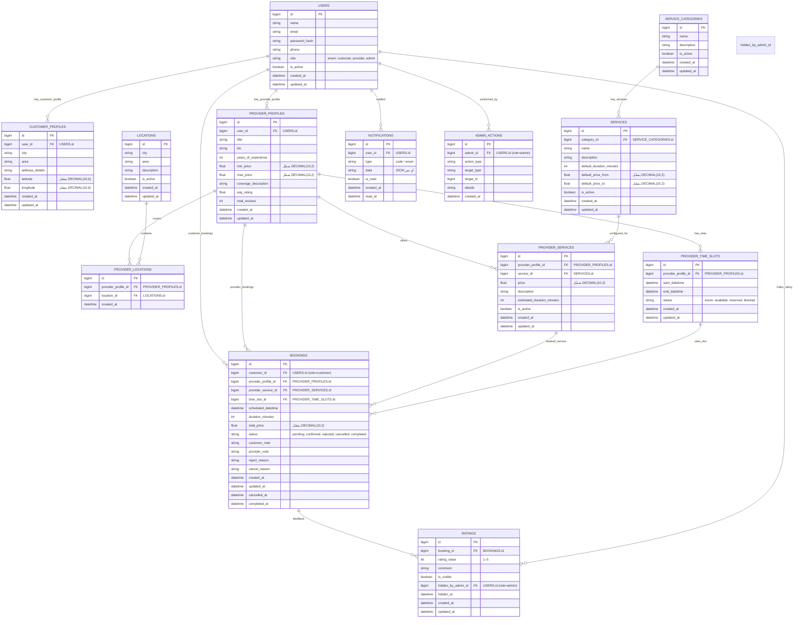

```mermaid
erDiagram

    %% ============================
    %% USERS & PROFILES
    %% ============================

    USERS {
        bigint  id PK
        string  name
        string  email
        string  password_hash
        string  phone
        string  role           "enum: customer, provider, admin"
        boolean is_active
        datetime created_at
        datetime updated_at
    }

    CUSTOMER_PROFILES {
        bigint  id PK
        bigint  user_id FK      "USERS.id"
        string  city
        string  area
        string  address_details
        float   latitude        "يفضّل DECIMAL(10,6)"
        float   longitude       "يفضّل DECIMAL(10,6)"
        datetime created_at
        datetime updated_at
    }

    PROVIDER_PROFILES {
        bigint  id PK
        bigint  user_id FK      "USERS.id"
        string  title
        string  bio
        int     years_of_experience
        float   min_price       "يفضّل DECIMAL(10,2)"
        float   max_price       "يفضّل DECIMAL(10,2)"
        string  coverage_description
        float   avg_rating
        int     total_reviews
        datetime created_at
        datetime updated_at
    }

    %% ============================
    %% LOCATIONS & COVERAGE
    %% ============================

    LOCATIONS {
        bigint  id PK
        string  city
        string  area
        string  description
        boolean is_active
        datetime created_at
        datetime updated_at
    }

    PROVIDER_LOCATIONS {
        bigint  id PK
        bigint  provider_profile_id FK   "PROVIDER_PROFILES.id"
        bigint  location_id FK          "LOCATIONS.id"
        datetime created_at
    }

    %% ============================
    %% SERVICE CATALOG
    %% ============================

    SERVICE_CATEGORIES {
        bigint  id PK
        string  name
        string  description
        boolean is_active
        datetime created_at
        datetime updated_at
    }

    SERVICES {
        bigint  id PK
        bigint  category_id FK          "SERVICE_CATEGORIES.id"
        string  name
        string  description
        int     default_duration_minutes
        float   default_price_from      "يفضّل DECIMAL(10,2)"
        float   default_price_to        "يفضّل DECIMAL(10,2)"
        boolean is_active
        datetime created_at
        datetime updated_at
    }

    PROVIDER_SERVICES {
        bigint  id PK
        bigint  provider_profile_id FK  "PROVIDER_PROFILES.id"
        bigint  service_id FK           "SERVICES.id"
        float   price                   "يفضّل DECIMAL(10,2)"
        string  description
        int     estimated_duration_minutes
        boolean is_active
        datetime created_at
        datetime updated_at
    }

    %% ============================
    %% PROVIDER AVAILABILITY
    %% ============================

    PROVIDER_TIME_SLOTS {
        bigint  id PK
        bigint  provider_profile_id FK  "PROVIDER_PROFILES.id"
        datetime start_datetime
        datetime end_datetime
        string  status                  "enum: available, reserved, blocked"
        datetime created_at
        datetime updated_at
    }

    %% ============================
    %% BOOKINGS
    %% ============================

    BOOKINGS {
        bigint  id PK
        bigint  customer_id FK          "USERS.id (role=customer)"
        bigint  provider_profile_id FK  "PROVIDER_PROFILES.id"
        bigint  provider_service_id FK  "PROVIDER_SERVICES.id"
        bigint  time_slot_id FK         "PROVIDER_TIME_SLOTS.id"
        datetime scheduled_datetime
        int     duration_minutes
        float   total_price             "يفضّل DECIMAL(10,2)"
        string  status                  "pending, confirmed, rejected, cancelled, completed"
        string  customer_note
        string  provider_note
        string  reject_reason
        string  cancel_reason
        datetime created_at
        datetime updated_at
        datetime cancelled_at
        datetime completed_at
    }

    %% ============================
    %% RATINGS / FEEDBACK
    %% ============================

    RATINGS {
        bigint  id PK
        bigint  booking_id FK           "BOOKINGS.id"
        int     rating_value            "1–5"
        string  comment
        boolean is_visible
        bigint  hidden_by_admin_id FK   "USERS.id (role=admin)"
        datetime hidden_at
        datetime created_at
        datetime updated_at
    }

    %% ============================
    %% NOTIFICATIONS & ADMIN LOGS
    %% ============================

    NOTIFICATIONS {
        bigint  id PK
        bigint  user_id FK              "USERS.id"
        string  type                    "code / enum"
        string  data                    "JSON أو نص"
        boolean is_read
        datetime created_at
        datetime read_at
    }

    ADMIN_ACTIONS {
        bigint  id PK
        bigint  admin_id FK             "USERS.id (role=admin)"
        string  action_type
        string  target_type
        bigint  target_id
        string  details
        datetime created_at
    }

    %% ============================
    %% RELATIONSHIPS
    %% ============================

    %% Users & Profiles
    USERS ||--o{ CUSTOMER_PROFILES : has_customer_profile
    USERS ||--o{ PROVIDER_PROFILES : has_provider_profile

    %% Provider coverage
    PROVIDER_PROFILES ||--o{ PROVIDER_LOCATIONS : covers
    LOCATIONS        ||--o{ PROVIDER_LOCATIONS : contains

    %% Service catalog
    SERVICE_CATEGORIES ||--o{ SERVICES          : has_services
    PROVIDER_PROFILES   ||--o{ PROVIDER_SERVICES : offers
    SERVICES            ||--o{ PROVIDER_SERVICES : configured_for

    %% Provider availability
    PROVIDER_PROFILES ||--o{ PROVIDER_TIME_SLOTS : has_slots

    %% Bookings
    USERS             ||--o{ BOOKINGS           : customer_bookings
    PROVIDER_PROFILES ||--o{ BOOKINGS           : provider_bookings
    PROVIDER_SERVICES ||--o{ BOOKINGS           : booked_service
    PROVIDER_TIME_SLOTS ||--o{ BOOKINGS         : uses_slot

    %% Ratings
    BOOKINGS ||--o{ RATINGS : feedback
    USERS    ||--o{ RATINGS : hides_rating      "hidden_by_admin_id"

    %% Notifications & Admin actions
    USERS ||--o{ NOTIFICATIONS : notified
    USERS ||--o{ ADMIN_ACTIONS : performed_by

```